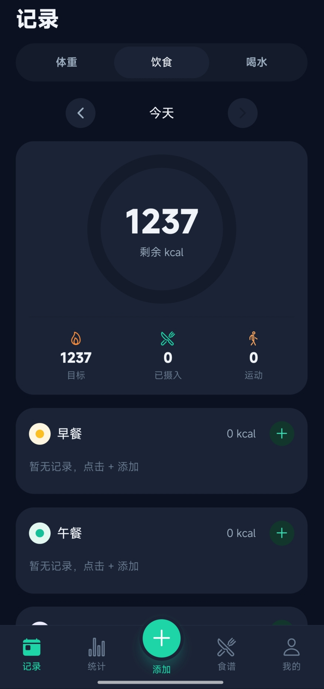
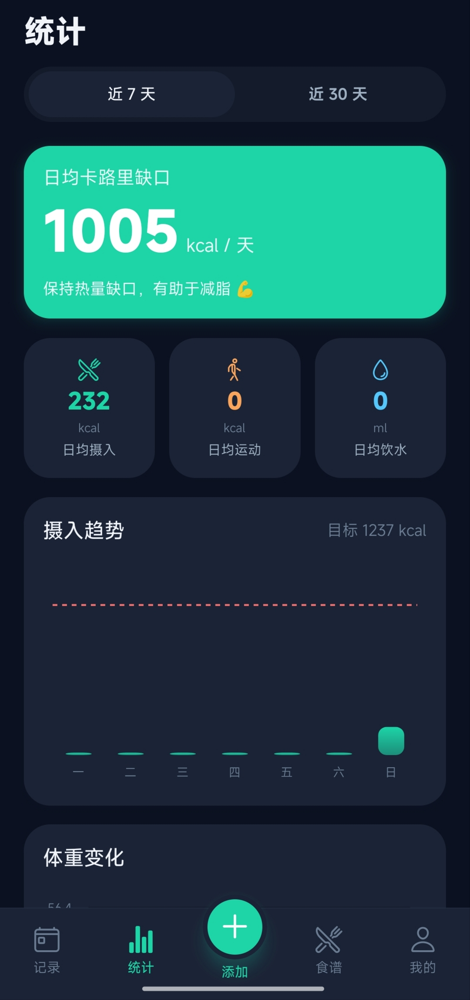
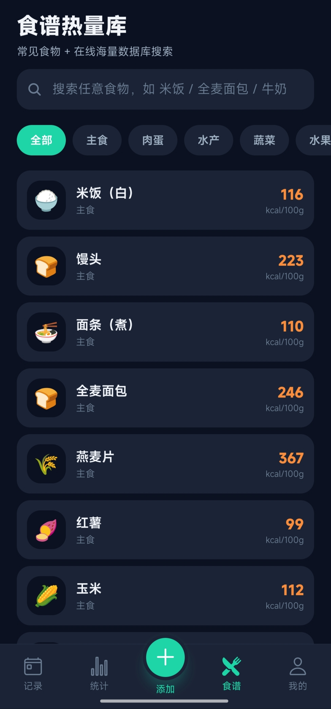
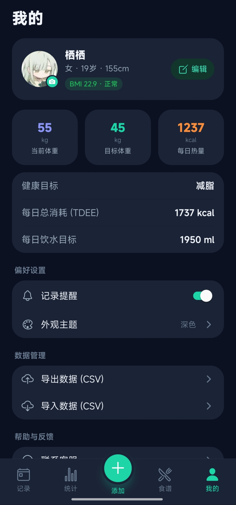

# 零卡 Kcalix · 卡路里计算器

一款界面简洁、功能完整的卡路里管理 App，记录与分析每日的**饮食摄入、运动消耗、体重变化、饮水量**。基于 **Expo + React Native + TypeScript**，数据全部保存在手机本地，保护隐私。

## 预览

| 记录 | 统计 | 食谱 | 我的 |
| :--: | :--: | :--: | :--: |
|  |  |  |  |


## 功能一览

- **首次引导**：条款确认 + 性别 / 昵称 / 年龄 / 身高 / 体重 / 目标 / 活动量设置，仅首次需要，数据持久化。
- **五个 Tab**：记录、统计、添加（悬浮主按钮）、食谱、我的。
- **记录页**：饮食（剩余热量圆环、三餐与运动记录、近 7 天柱状图）、体重（BMI、周/月/年趋势、目标进度）、喝水（进度圆环、快速记录、饮水记录）。
- **统计页**：日均卡路里收支、日均摄入/运动/饮水、摄入趋势与体重变化图表。
- **添加页**：饮食、运动、体重、喝水，**均可指定记录日期**。
- **食谱页**：本地常见食物 + 在线海量数据库（Open Food Facts）搜索，外文结果**自动翻译为中文**，支持模糊搜索。
- **我的页**：资料/目标编辑、**自定义头像**、**浅色/深色/跟随系统主题**、**CSV 导入导出全部数据**、提醒开关、联系客服、意见反馈、关于、协议、隐私、开源清单、清除数据。

## 技术栈

- Expo SDK 56 / React Native 0.85 / React 19
- expo-router（文件式路由）
- react-native-svg（自绘图表与进度圆环）
- @react-native-async-storage/async-storage（本地持久化）
- expo-image-picker / expo-file-system / expo-sharing / expo-document-picker

## 目录结构

```
app/
  _layout.tsx        # 根布局：Provider + 导航栈 + 主题
  index.tsx          # 启动入口
  onboarding.tsx     # 首次引导
  legal.tsx          # 关于 / 协议 / 隐私 / 开源清单
  appearance.tsx     # 外观主题设置
  (tabs)/            # 记录 / 统计 / 添加 / 食谱 / 我的
src/
  theme.ts           # 设计系统 + 浅/深色主题
  store/AppStore.tsx # 全局状态 + 持久化
  data/              # 食物库、在线搜索与翻译
  utils/             # 日期、营养计算、CSV、聚合
  components/        # UI 组件、图表、日期选择器
assets/images/       # logo 与默认头像（可直接覆盖替换）
```

## 本地运行

> 前提：Node.js 18+，安卓手机安装 **Expo Go**。

```bash
npm install
npx expo start
```

启动后用 Expo Go 扫描终端二维码即可运行（手机与电脑同一网络）。

## 打包安卓 APK

使用 Expo 云构建，无需本地 Android SDK：

```bash
npm install -g eas-cli
eas login
npx expo install --fix          # 对齐依赖版本
eas build -p android --profile preview
```

构建完成后 EAS 会给出 `.apk` 下载链接，在安卓手机浏览器打开即可安装。

## 替换图片

`assets/images/` 下用**同名文件覆盖**即可（无需改代码）：`logo.png`、`avatar-male.png`、`avatar-female.png`。
应用图标与启动屏在 `assets/`（`icon.png`、`splash-icon.png`、`android-icon-*.png`），替换后需重新 `eas build` 生效。

## 说明

- 卡路里、基础代谢（Mifflin-St Jeor）、TDEE 均为估算值，仅供参考，不能替代专业医疗或营养建议。
- 数据仅保存在设备本地，卸载或「我的 → 清除所有数据」将永久删除。
